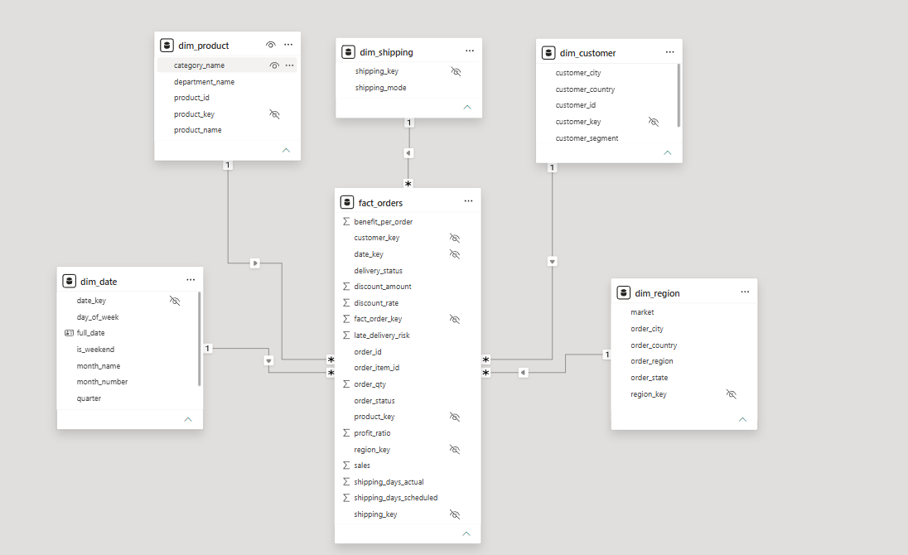
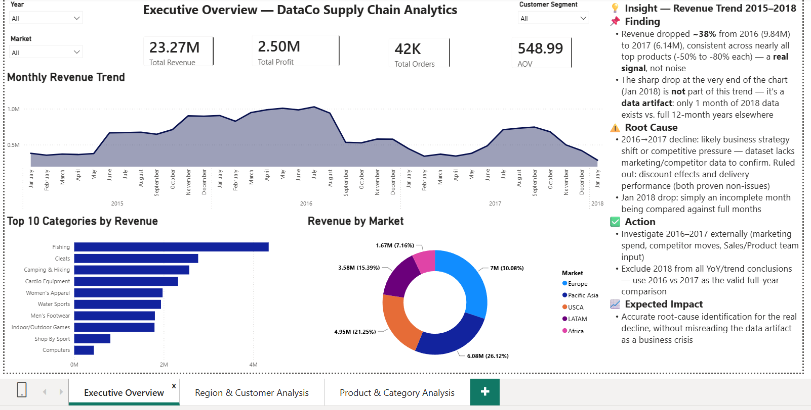
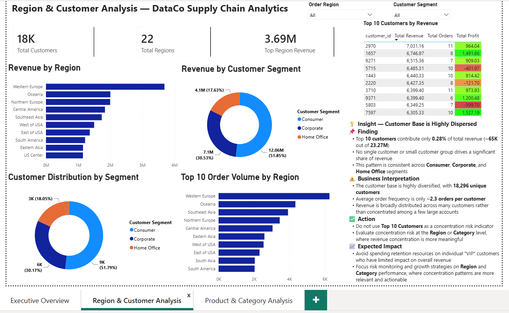
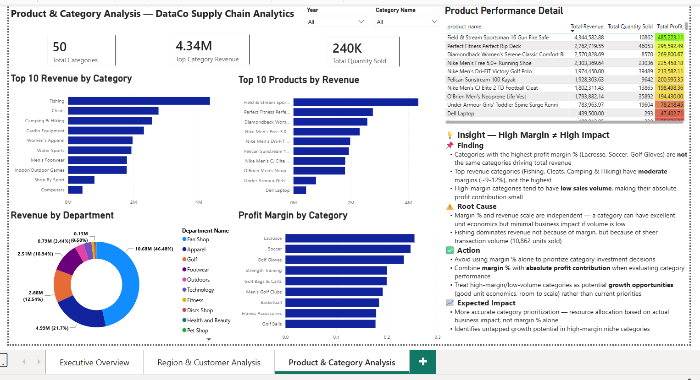

# 📦 DataCo Supply Chain Analytics

> End-to-end data analytics project — from raw CSV to a production-style Star Schema, validated KPIs, and an interactive Power BI dashboard. Built with a strong emphasis on **data quality investigation**: distinguishing real business signals from synthetic/noise patterns before drawing conclusions.


---

## 📌 Overview

This project analyzes the [DataCo Smart Supply Chain dataset](https://www.kaggle.com/datasets/shashwatwork/dataco-smart-supply-chain-for-big-data-analysis) (114,187 transaction rows, Jan 2015 – Jan 2018) through a full analytics engineering pipeline:

**Raw CSV → DuckDB → Cleaned & Validated Data → Star Schema → Data Mart → Power BI Dashboard**

What makes this project different from a typical "load data, make chart" project is the **data quality investigation layer** — several metrics that look legitimate at first glance (delivery performance, discount effectiveness, order loss rate) were statistically tested and proven to be **synthetic artifacts**, not real business signals. Every KPI used in the final dashboard is backed by an explicit validity check.

---

## 🧭 Project Structure (6 Phases)

| Phase | Focus | Docs |
|---|---|---|
| **1. Business Understanding** | Define business problems, design KPIs, establish validity rules | [`docs/01_Business_Understanding`](docs/01_Business_Understanding) |
| **2. Data Preparation** | Collect, profile, clean, and validate raw data | [`docs/02_Data_Preparation`](docs/02_Data_Preparation) |
| **3. Data Modeling** | Build Star Schema (fact + 5 dimension tables) | [`docs/03_Data_Modeling`](docs/03_Data_Modeling) |
| **4. Analytics** | EDA, sales/product analysis, region/customer analysis | [`docs/04_Analytics`](docs/04_Analytics) |
| **5. Data Mart & Reporting** | Build data marts, connect to Power BI | [`docs/05_Data Mart_and_Reporting`](<docs/05_Data Mart_and_Reporting>) |
| **6. Insight & Recommendation** | Consolidate findings, define action plan | [`docs/06_Insight_and_recomendation`](docs/06_Insight_and_recomendation) |

Each phase follows a consistent documentation format: **Tujuan (Objective) → Input → Proses Analisis → Temuan (Findings) → Output → Kesimpulan (Conclusion)** — both in `.md` narrative form and matching `.sql` query files.

---

## 🗂️ Repository Structure

```
📦 dataco-supply-chain-analytics
├── 📄 README.md
├── 📁 docs/                          # Narrative documentation (.md), 6 phases
│   ├── 01_Business_Understanding/
│   ├── 02_Data_Preparation/
│   ├── 03_Data_Modeling/
│   ├── 04_Analytics/
│   ├── 05_Data Mart_and_Reporting/
│   └── 06_Insight_and_recomendation/
├── 📁 sql/                           # Executable SQL queries, mirrors docs structure
│   ├── 01_Business_Understanding/
│   ├── 02_Data_Preparation/
│   ├── 03_Data_Modeling/
│   ├── 04_Analytics/
│   └── 05_Data Mart_and_Reporting/
├── 📁 screenshots/                   # Dashboard & model previews
└── 📁 dashboard/                     # Power BI file
    └── DataCo_Supply_Chain_Analytics.pbix
```

---

## 🏗️ Data Model — Star Schema



- **Fact table**: `fact_orders` — grain: 1 row = 1 order item
- **Dimensions**: `dim_customer`, `dim_product`, `dim_region`, `dim_date`, `dim_shipping`
- Full ERD source: [`docs/03_Data_Modeling/star_schema_erd.mermaid`](<docs/03_Data_Modeling/star_schema_erd.mermaid>)

---

## 📊 Dashboard Preview

| Executive Overview | Region & Customer Analysis |
|---|---|
|  |  |

| Product & Category Analysis |
|---|
|  |

📥 **[Download the .pbix file](dashboard/DataCo_Supply_Chain_Analytics.pbix)** to explore interactively.

> **Note on Page 4 (Data Quality Notes):** a 4th dashboard page was originally planned to display the `data_quality_flags` table directly inside Power BI (with a traffic-light severity indicator). It was ultimately **not built as a standalone page** — instead, the same findings are surfaced as contextual insight cards on Pages 1–3, right next to the charts they relate to. The full design spec for this page (table structure, conditional formatting rules) is documented in [`docs/05_Data Mart_and_Reporting/page4_data_quality_notes.md`](<docs/05_Data Mart_and_Reporting/page4_data_quality_notes.md>), and the underlying `data_quality_flags` table is fully available in the Parquet export and Power BI model for anyone who wants to build it.

---

## 🔍 Key Findings

### ✅ Validated Business Insights
1. **Revenue Decline 2016→2017 (-38%)** — a confirmed real signal, consistent across nearly all top products, not explained by discount or delivery factors.
2. **Customer Base is Highly Dispersed** — Top 10 customers contribute only 0.28% of total revenue; concentration risk is more meaningful at the Region/Category level.
3. **High Margin ≠ High Impact** — categories with the highest margin % are not the categories driving the most absolute profit.

### ⚠️ Data Quality Findings (ruled out as valid KPIs)
| Finding | Severity | Why It's Invalid |
|---|---|---|
| Delivery performance (`shipping_days_actual`, `delivery_status`) | 🔴 High | Fully deterministic from `shipping_mode` — zero natural variance |
| Discount effectiveness | 🟡 Medium | Correlation with quantity/profit ≈ 0 across all discount levels |
| ~19% order loss rate | 🟡 Medium | Uniformly distributed across every dimension — random noise, not a business-specific issue |
| Customer ID integrity (Nov 2017–Jan 2018) | 🔴 High | 100% of orders in this window appear as "new customers" — structural data defect |

Full findings table: [`docs/06_Insight_and_recomendation/12_key_findings.md`](docs/06_Insight_and_recomendation/12_key_findings.md)

---

## 🛠️ Tech Stack

| Tool | Purpose |
|---|---|
| **DuckDB** | Primary SQL engine for data prep, modeling, and export |
| **PostgreSQL / pgAdmin** | Secondary environment for SQL practice & interview-style querying |
| **Power BI Desktop** | Interactive dashboard, DAX measures, Star Schema modeling |
| **Parquet** | Columnar export format between DuckDB and Power BI |

---

## 🚀 How to Reproduce

1. Download the [DataCo Smart Supply Chain dataset](https://www.kaggle.com/datasets/shashwatwork/dataco-smart-supply-chain-for-big-data-analysis) from Kaggle
2. Run SQL scripts in `sql/` folder in order (01 → 05) using DuckDB CLI
3. Exported Parquet files will be generated for the Star Schema and Data Mart layer
4. Open `dashboard/DataCo_Supply_Chain_Analytics.pbix` in Power BI Desktop and repoint the data source to your local Parquet files

---

## 👤 Author

**Ahmad Farid**

- 📧 Email: [ahmad.fariden@gmail.com](mailto:ahmad.fariden@gmail.com)
- 💼 LinkedIn: [linkedin.com/in/ahmadfariden](https://linkedin.com/in/ahmadfariden)
- 💻 GitHub: [github.com/ahmadfariden](https://github.com/ahmadfariden)

---

<p align="center"><i>Built as a hands-on SQL & analytics engineering learning project — every insight here was validated, not assumed.</i></p>
